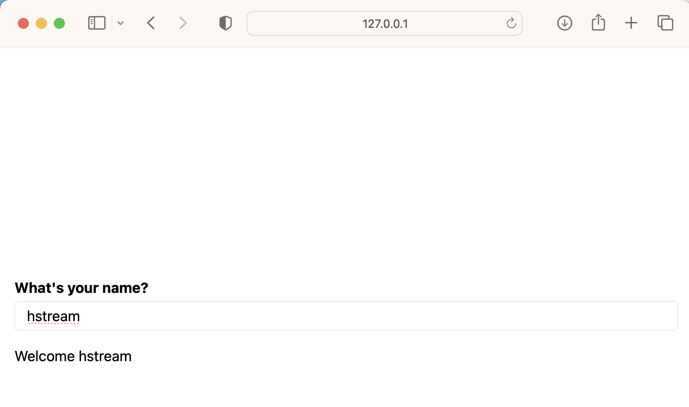
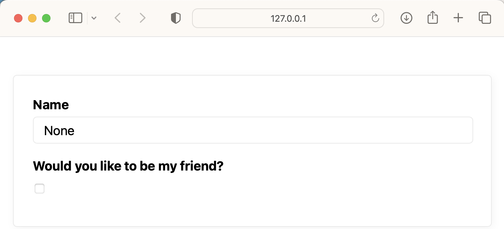
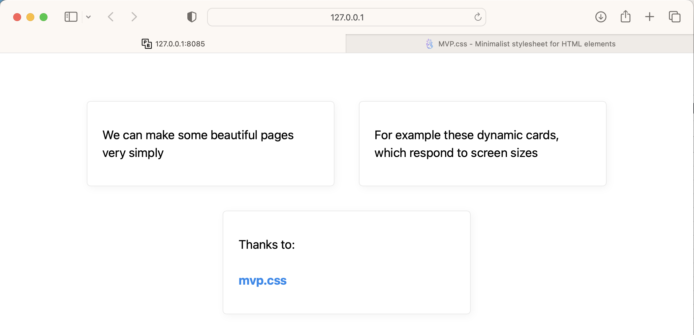

# HStream

Easiest interactive python web app using htmx and semantic html

# Usage

`pip install hstream`

```
# main.py

from hstream import hs

visitor_name = hs.text_input("What's your name?", default_value = "friend")

hs.markdown(f"Welcome {visitor_name}")
```

`python -m hstream main.py`



# Motivation

Love Streamlit but:

- impossible to customise beyond PoC phase
- hard to reason about when extending and deploying
- non-standard approach doesn't play nicely with existing ecosystems

H-(html)-Stream is built with semantic html, FastApi and htmx to provide a fast and simple framework for rapid web app development that follows traditional frontend/server architecture (or at least follow it closer than Streamlit).

# Features

- [x] only reloads changed components after the visitor provides input
- [x] live server reload on file change (through univorn)
- [x] semantic html and basic html manipulation from within script
- [x] basic components - see below
- [x] swap stylesheet
- [x] complex html manipulation from within script (setting attributes)
- [ ] auto ssl certs for easy deployment
- [ ] plotly plot support
- [ ] select and multi select components

# Bugs

- key handling is a little inconsistent and it's not clear to the user when they need to use keys - meaning if you run into reloading / rending issues provide all you components with unique `key` parameter

## Components

`hs.markdown`

`hs.text_input`

`hs.checkbox`

`hs.button`: renders and evaluates to true if the user click the button (still a little unsure exactly how this should be implemented as evaluating to true doesn't quite capture the ideal of pressing a button)

`hs.slider`: numeric slider input

`hs.plot`: output matplotlib figures to the user

`hs.image`: display an image

`hs.html`: allows more complex formatting, for example 

Form example:

- a html form

```
from hstream import hs
with hs.html('form'):
    hs.text_input('Name')
    hs.checkbox('Would you like to be my friend?')
```



- a card provided by [mvp.css](https://andybrewer.github.io/mvp/)

```
from hstream import hs
with hs.html('section'):
    with hs.html('aside'):
        hs.markdown('We can make some beautiful pages very simply')
    with hs.html('aside'):
        hs.markdown('For example these responsive cards, which respond to screen sizes')
    with hs.html('aside'):
        hs.markdown('Thanks to: ')
        with hs.html('a', href='https://andybrewer.github.io/mvp/'):
            hs.markdown('mvp.css')
```



`hs.stylesheet_href = https://unpkg.com/@vladocar/basic.css@1.0.3/css/basic.css` to use a different classless css framework

`hs.app`: to directly access the FastAPI instance if you want to extend it like a normal webserver (i.e. add custom paths, static files ect.)

# Technologies

Big thanks to the following libraries in particular

- Streamlit
- htmx
- Yattag
- MVP.css
- FastAPI
- uvicorn
