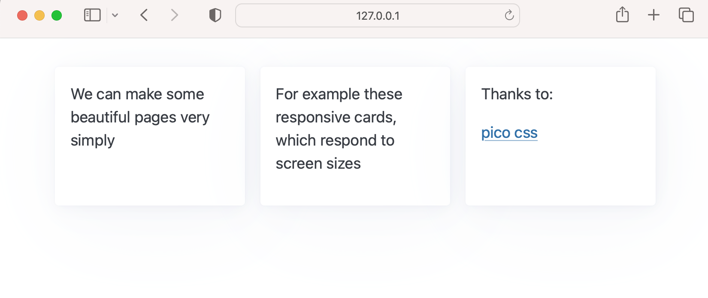

# HStream

Convert your script to interactive python web app like so:

    `user_said = hs.text_input("What would you like to say:")`

Powered by [Django](https://github.com/django/django) + [htmx](https://github.com/bigskysoftware/htmx) enables easy app ejection to scale/extend once you've outgrown HStream. Inspired by [Streamlit](https://github.com/streamlit/streamlit).

# Usage

`pip install hstream`

`hstream init`

`hstream run example.py`


See by the [example](./demo/example.py) above how intuitive building with HStream is?

```
# example.py

from hstream import hs
page = hs.nav(["Home", "About"],default_value="Home", key="nav")

if page == "About":
    hs.markdown("For more info visit [github](github.com/conradbez/hstream)")

with hs.html("header"):
    hs.markdown(
        """## HStream
        Offers great flexibility in developing Python web apps easily
""",
    )

```

And as you can see we get a fully interactive web app - ready for deployment!


# Ejection to a Django app

One of the key features of HStream is not having to start over when your project outgrows the linear script structure of HStream. This out growing could be due to needing to implement more complex authentication, more custom user flows or any number of other issues I have faced in building real world PoC's with Streamlit in the past.

Whatever it may be, when you do (hopefully) reach that point just run:

`hstream eject`

`python manage.py runserver` <- this is now running a full fledge Django instance you can edit as you please :)

We'll put your current working app in your directory as a traditional Django app for you to add more routes onto the working HStream endpoint.

*Caveat:* the HStream part of the server won't follow a typical Django web app structure, but you can go ahead and develop the rest of your service in traditional Django fashion.

# [Examples]((./demo))

# Motivation

Love Streamlit but:

- impossible to customise beyond PoC phase
- hard to reason about when extending and deploying
- non-standard approach doesn't play nicely with existing ecosystems

H-(html)-Stream is built with semantic html, Django and htmx to provide a fast and simple framework for rapid web app development that follows traditional frontend/server architecture (or at least follow it closer than Streamlit).

## Components

`hs.markdown`

`hs.text_input`

`hs.checkbox`

`hs.button`: renders and evaluates to true if the user click the button (still a little unsure exactly how this should be implemented as evaluating to true doesn't quite capture the ideal of pressing a button)

`hs.slider`: numeric slider input

`hs.plot`: output matplotlib figures to the user

`hs.image`: display an image

`hs.write_dataframe`: output a pandas dataframe like in this [example](./demo/example_dataframe.py)


`hs.html`: allows more complex formatting, for example:

`hs.set_primary_color`: to change your color scheme (because we are html first you can also change styling more directly!)

- a card provided by [pico.css](https://andybrewer.github.io/mvp/)

```
from hstream import hs
with hs.grid():
    with hs.html('article'):
        hs.markdown('We can make some beautiful pages very simply')
    with hs.html('article'):
        hs.markdown('For example these responsive cards, which respond to screen sizes')
    with hs.html('article'):
        hs.markdown('Thanks to: ')
        with hs.html('a', href='https://picocss.com'):
            hs.markdown('pico css')
```



`hstream eject`: gives a dockerfile and step by step commands to deploy to Railway

# Technologies

Big thanks to the following libraries in particular

- Streamlit
- htmx
- Yattag
- pico css
- Django

# Features (WIP)

- [x] live server reload on file change (through univorn)
- [x] semantic html and basic html manipulation from within script
- [x] basic components - see below
- [x] swap stylesheet
- [x] complex html manipulation from within script (setting attributes)
- [x] plotly plot support
- [x] select component
- [x] multi select component
- [ ] auto ssl certs for easy deployment
- [ ] example component architecture
- [ ] reload browser on code change
