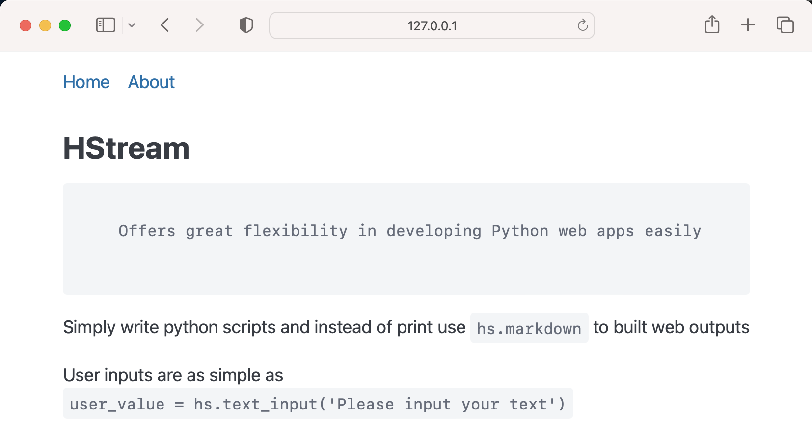
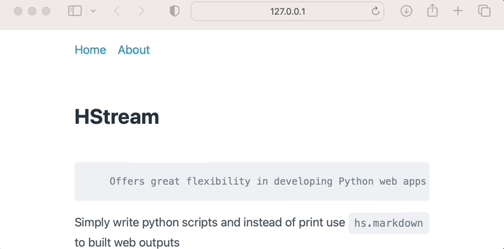
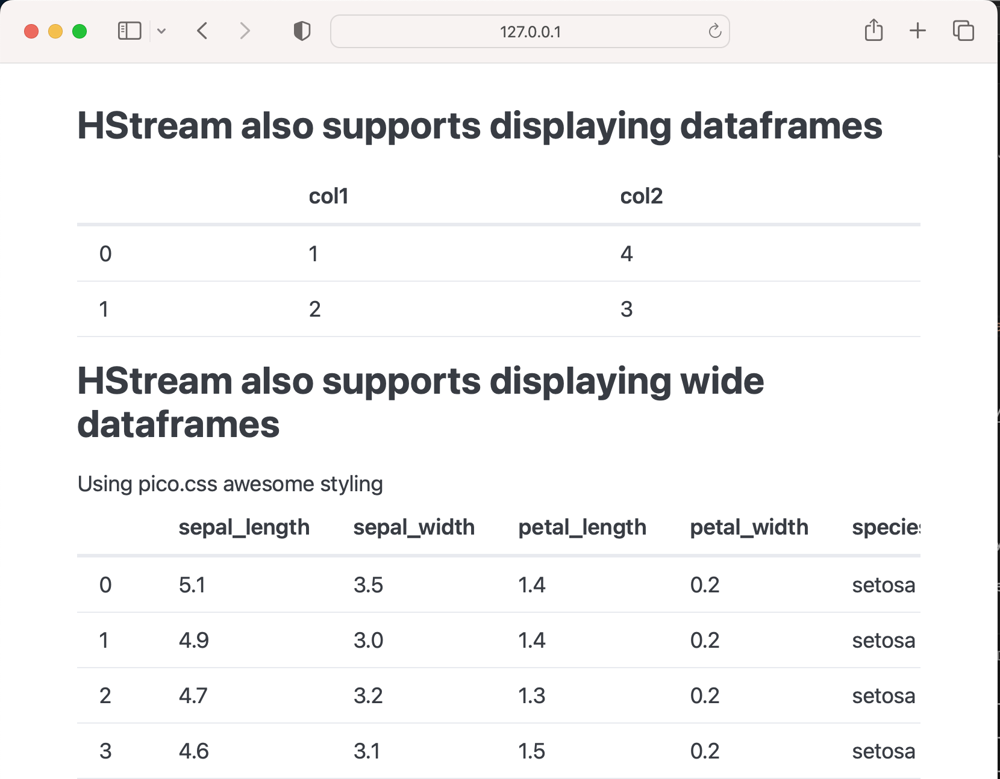

# HStream

Easiest interactive python web app using htmx and semantic html

# Usage

`pip install hstream`

`hstream init`

`hstream run example.py`



See by the [example](./demo/example.py) above how intuitive building with HStream is?

```
# example.py

from hstream import hs
page = hs.nav(["Home", "About"],default_value="Home", key="nav")

if page == "About":
    hs.markdown("For more info visit [github](github.com/conradbez/hstream)")
    
with hs.html("header"):
    hs.markdown(
        """## HStream
        Offers great flexibility in developing Python web apps easily
""",
    )

```

And as you can see we get a fully interactive web app - ready for deployment!




# Examples

- [Select demo](./demo/select.md)
- [Static files](./demo/static_files.md)
- [Theming](./demo/theming.md)
- [More](./demo)

# Motivation

Love Streamlit but:

- impossible to customise beyond PoC phase
- hard to reason about when extending and deploying
- non-standard approach doesn't play nicely with existing ecosystems

H-(html)-Stream is built with semantic html, FastApi and htmx to provide a fast and simple framework for rapid web app development that follows traditional frontend/server architecture (or at least follow it closer than Streamlit).

# Features

- [x] live server reload on file change (through univorn)
- [x] semantic html and basic html manipulation from within script
- [x] basic components - see below
- [x] swap stylesheet
- [x] complex html manipulation from within script (setting attributes)
- [x] plotly plot support
- [x] select component
- [x] multi select component
- [ ] auto ssl certs for easy deployment
- [ ] example component architecture
- [ ] reload browser on code change

## Components

`hs.markdown`

`hs.text_input`

`hs.checkbox`

`hs.button`: renders and evaluates to true if the user click the button (still a little unsure exactly how this should be implemented as evaluating to true doesn't quite capture the ideal of pressing a button)

`hs.slider`: numeric slider input

`hs.plot`: output matplotlib figures to the user

`hs.image`: display an image

`hs.write_dataframe`: output a pandas dataframe like in this [example](./demo/example_dataframe.py)



`hs.html`: allows more complex formatting, for example:

`hs.set_primary_color`: to change your color scheme (because we are html first you can also change styling more directly!)

- a card provided by [pico.css](https://andybrewer.github.io/mvp/)

```
from hstream import hs
with hs.grid():
    with hs.html('article'):
        hs.markdown('We can make some beautiful pages very simply')
    with hs.html('article'):
        hs.markdown('For example these responsive cards, which respond to screen sizes')
    with hs.html('article'):
        hs.markdown('Thanks to: ')
        with hs.html('a', href='https://picocss.com'):
            hs.markdown('pico css')
```


# Technologies

Big thanks to the following libraries in particular

- Streamlit
- htmx
- Yattag
- pico css
- MVP.css
- FastAPI
- uvicorn