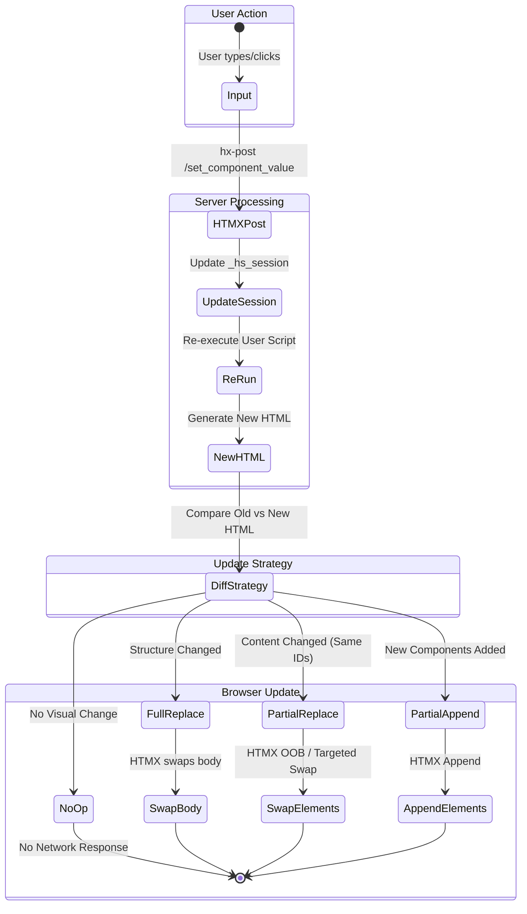

# HStream Architecture

## System State Diagrams

### Flow 1: Initialization (Startup to First Render)

This flow covers the process from running the command to the user seeing the initial page.

```mermaid
stateDiagram-v2
    direction LR

    state "CLI & Server Startup" as Startup {
        [*] --> RunCommand: hstream run <script>
        RunCommand --> DjangoBoot: run_server()
        DjangoBoot --> SetEnv: Set HS_FILE_TO_RUN
        SetEnv --> Listen: Server Listening (Port 8000)
    }

    state "First Request" as Request {
        Listen --> BrowserGet: User visits /
        BrowserGet --> ExecuteScript: Django View executes script
        ExecuteScript --> BuildDoc: hs components build HTML (yattag)
        BuildDoc --> ReturnHTML: Full HTML Response
        ReturnHTML --> Render: Browser Renders Page
        Render --> [*]: HTMX initialized
    }
```



### Flow 2: Interaction & Updates (The HTMX Loop)

This flow details how user interactions trigger updates, highlighting the diffing strategy used to minimize re-renders.



> [!NOTE]
> **Swap vs Refresh Caveats**:
> *   **Full Replace**: Used when the component structure changes significantly. This is the safest fallback but resets the DOM state (e.g., focus, scroll position) unless carefully managed.
> *   **Partial Replace/Append**: HStream attempts to preserve the DOM by only updating changed elements (identified by consistent IDs). This maintains user focus and input state better than a full refresh.
>
> ```python
> strategy = pick_a_strategy(prev_html, new_html, hs_script_running)
> # Returns: "1_full_replace", "2_nothing", "3_partial_replace", or "4_partial_append"
> ```


## Key File Descriptions

| File | Description |
| :--- | :--- |
| `hstream/__init__.py` | Entry point for the package. Initializes and exports the main `hs` instance used by end-users to build their UI. |
| `hstream/hs.py` | Defines the `hs` class, which combines `Components` and `StyledComponents`. It manages the underlying HTML document construction using `yattag`. |
| `hstream/run.py` | Contains the logic to start the HStream server. It wraps the Django `manage.py` command, sets necessary environment variables (like the target script path), and launches the web server. |
| `hstream/utils.py` | Provides utility functions for HTML processing and optimization. Includes logic for detecting duplicate IDs, splitting code blocks, and determining the best strategy for updating the DOM (full replace, partial replace, etc.). |
| `hstream/components/components.py` | The core library of UI components (e.g., `text_input`, `button`, `nav`). It defines how each component is rendered to HTML and how it handles user input via HTMX attributes and session state. |
