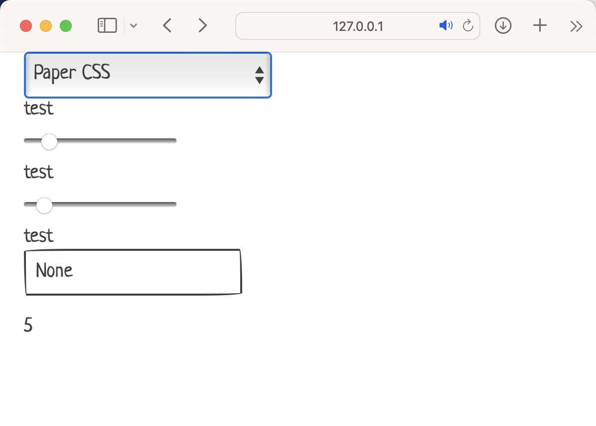

# Theming

Using class based html theming we're able to easily switch the look and feel of our apps.

Simply add 

```

hs.html('script',
    ('src', "https://dohliam.github.io/dropin-minimal-css/switcher.js"),
    ('type', "text/javascript"),
    ):
    pass

```

to your app to achieve a dropdown with theme selection




We're utilizing the awesome work of [dropin-minimal-css](https://github.com/dohliam/dropin-minimal-css) and taking advantage of HStream using [Yattag](https://www.yattag.org) internally to easily add theming to the app.

After you select a theme simple remove the above and include the theme in your app like so:

`hs.stylesheet_href = "https://cdn.jsdelivr.net/gh/dohliam/dropin-minimal-css/src/bahunya.css"`
or
`hs.stylesheet_href = hs.list_css_frameworks()["bahunya.css"]`